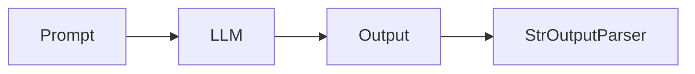
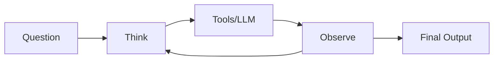

## LangChain vs. LangGraph

There's a major drawback of LangChain which is, that it can work only in one direction.

The Chaining only works in a single direction.
There's no way in this, that we can go back and check whether the output we getting is correct or not.

If we are trying to connect multiple components, we won't be able to go back.

To tackle with drawback, they came up with the concept of `Agent`.

Here, `Agent` works inside a loop.

